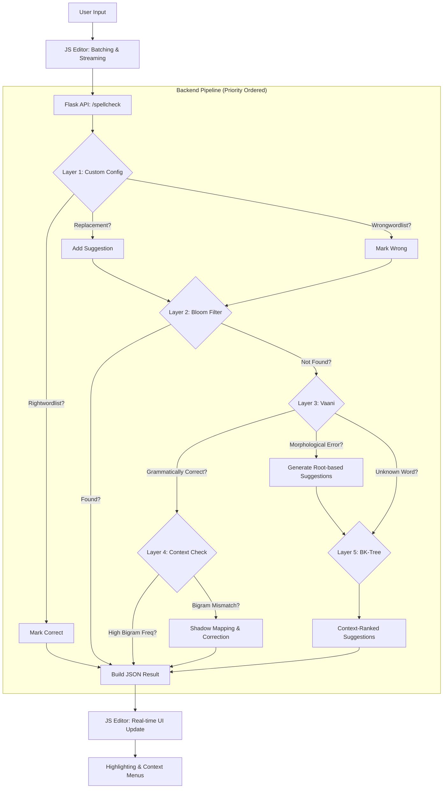

# Iyal Tamil Spellchecker Architecture

This document describes the technical architecture and request flow of the Iyal Tamil Spellchecker (v0.0.3+).

## 🛠️ System Overview

The system is designed as a **Priority-Based Hybrid Validation Pipeline** that balances speed (Bloom Filters) with accuracy (Rule-based Morphology) and user control (Custom Overrides).

### 🎨 Visual Architecture


### 🗺️ Request Flow Diagram (ASCII)
```text
[ USER UI (Vanilla JS) ] 
       |
       | (Batch Streaming POST)
       v
[ FLASK BACKEND (app.py) ]
       |
       +--- 0. INSTRUMENTATION (Request Timers & Latency Tracking)
       |
        +--- 1. CUSTOM OVERRIDES (replacements.txt, rightwordlist.txt, wrongwordlist.txt)
       |
       +--- 2. L1 CACHE (Bloom Filter: Instant Dictionary Check)
       |
        +--- 3. L1.5 MORPHOLOGY (tamil_grammar_morphology.py: Sandhi, Suffix-Stripping, Doubled-Consonant support)
       |
       +--- 4. L2 CONTEXT (Bigram DB: Ranking & Grammar Shadow Match)
       |
       +--- 5. L3 ENGINE (Vaani: Morphological Rule-Check)
       |
       +--- 6. L4 FALLBACK (BK-Tree: Context-Weighted Similarity Search)
       |
       v
[ JSON RESPONSE ] --> (X-Process-Time Header) --> (UI Highlight)
```

### 🛰️ Flow Diagram (Mermaid)



use https://www.eraser.io to generate a beautiful diagram 
---

## 🏗️ Detailed Layer Breakdown

### 1. The Frontend (Vanilla JS)
*   **Editor**: A `contenteditable` area with custom rendering for underlines.
*   **Streaming**: Large texts are split into batches and sent as asynchronous POST requests to prevent UI freezing.
*   **Interaction**: Handles context menus for picking suggestions and real-time telemetry (Words/sec, ETA).

### 2. The Custom Layer (Priority 1)
*   **Rightwordlists**: Project-specific names or technical terms.
*   **Wrongwordlists**: Prevents common fragments or noisy results from the rule-based engine.
*   **Replacements**: Enforces formal Tamil vocabulary (e.g., `Bus` -> `பேருந்து`) or intentional colloquial splits (e.g., `தொடங்கும்போது` -> `தொடங்கும் போது`).
*   *Note*: Checked **before** the whitelist and dictionary to allow users to override standard rules with intentional variations.

## 🚀 Scalability: Handling Large Content

To process huge documents (e.g., 50+ pages) without crashing the server or freezing the browser, Iyal uses a **Batch-and-Stream** strategy:

1.  **Client-Side Partitioning**: When a user clicks 'Check', the JavaScript editor splits the text into small batches (default: ~200 words).
2.  **Parallel Asynchronous POSTs**: Instead of one giant request, Iyal sends multiple small requests in sequence. This prevents **HTTP Timeouts** and ensures the server never has to hold a massive document in memory at once.
3.  **Stateless Backend Processing**: Each request to `/spellcheck` is independent. The backend processes the batch, generates suggestions, and returns JSON. 
4.  **Non-Blocking UI**: The UI remains interactive. Results are streamed back into the editor as they arrive, highlighting errors in real-time while the rest of the document is still being checked.
5.  **Telemetry Dashboard**: A real-time counter displays processing speed (Words/sec) and a dynamic ETA, giving the user constant feedback on long-running tasks.

### 3. The Dictionary Layer (Bloom Filter)
*   **Technology**: Probabilistic data structure (`tamil_bloom.pkl`).
*   **Performance**: Near-instant check (O(1)) for ~1 million valid Tamil words.

### 4. The Morphological Layer (Vaani)
*   **Logic**: Uses a rule-based engine to break down words into root + suffix (Sandhi analysis).
*   **Doubled-Consonant Support**: Advanced support for doubled markers (`-ட்டை`, `-த்தை`, `-ப்பை`, `-க்கை`, `-ச்சை`) across all cases, ensuring loan words and specific noun classes are correctly resolved.
*   **Features**: Validates complex derivations that aren't in standard lists and generates suggestions that respect Tamil joining rules.

### 5. The Fuzzy Layer (BK-Tree)
*   **Technology**: Metric tree based on Levenshtein distance.
*   **Purpose**: If all other engines fail, it finds the "nearest" words in the corpus to offer last-resort suggestions.

---

## 📡 External Integrations
*   **LanguageTool**: A sidecar Java service used for concurrent grammar checking (e.g., subject-verb agreement).
*   **GitHub Version Check**: A background synchronization task that fetches `version.txt` from the main repository. It uses a 1-hour cache to avoid redundant network traffic and provides real-time update notifications in the UI.

## 🗄️ Data Storage
*   `user_config/`: Plain-text files for user overrides (`rightwordlist.txt`, `wrongwordlist.txt`, `replacements.txt`).
*   `messages.txt`: Content for the dynamic UI announcements box.
*   `version.txt`: Application version string.
*   `data/DB.json`: The rule-set for the Vaani engine.
*   `tamil_bloom.pkl` / `bk_tree.pkl`: Pre-indexed dictionary and fuzzy-search trees.


## 🛡️ Security Considerations & Hardening

Currently, the application is optimized for local/internal use. For public deployment, the following security architecture is recommended:

### 1. Existing Protections
*   **XSS Prevention**: The Jinja2 template engine automatically escapes user input. Suggestions and corrections rendered in the UI should always use `.innerText` rather than `.innerHTML` in JavaScript.
*   **Input Filtering**: The spellcheck logic primarily extracts Tamil unicode characters (`\p{Tamil}`), which inherently filters out most common script injection payloads.

### 2. Future Security Roadmap
*   **Rate Limiting**: Implementation of `Flask-Limiter` to prevent automated DOS (Denial of Service) attacks on the rule-based engine.
*   **Payload Validation**:
    *   Enforce a maximum request size (e.g., 2MB) in Flask (`MAX_CONTENT_LENGTH`).
    *   Validate input JSON schema to ensure only legitimate text is processed.
*   **Deployment Hardening**:
    *   **Debug Mode**: `debug=True` must be disabled in production to prevent stack trace leakage.
    *   **WSGI Server**: Use `Gunicorn` or `Waitress` instead of the built-in Flask development server.
    *   **Reverse Proxy**: Deploy behind `Nginx` to handle SSL/TLS termination and provide additional request filtering.
*   **CORS Policy**: Configure a strict `Cross-Origin Resource Sharing` policy to allow only authorized domains to consume the spellchecker API.
*   **HTML Awareness**: Implement sanitization layers to ensure that spellchecking logic does not inadvertently parse or execute embedded HTML tags within user-provided content.

## 🚀 Future Roadmap: Phase 2

### 1. HTML Layout & Table Retention
*   **Problem**: Highlighting currently disrupts the raw DOM structure, which can break tables and complex CSS designs.
*   **Plan**: Implement a **Recursive DOM Walker** in the frontend. This will allow the engine to find and wrap words within text nodes specifically, leaving `<table>`, `<div>`, and `<span>` layout tags untouched.
*   **Option**: Migrate to **TipTap / ProseMirror** for a professional rich-text experience that supports native "decorations" without direct HTML manipulation.

### 2. Refining Tamil Grammar Rules
*   **Contextual Shadow Matching**: Implemented statistical pronominal agreement using an **Ultra-Lite 26MB Bigram database**. This database is pruned to the **Top 100,000 core words** with **Top-3 continuations**, ensuring a tiny disk footprint while maintaining high-frequency contextual intelligence.
*   **Heuristic Fallback**: Developed a hardcoded pronominal agreement layer (`PRONOUN_AGREEMENT`) to ensure subject-verb harmony for common pronouns (நான், நீ, அவன், அவர்கள்). This provides a deterministic safety net for grammar errors that fall outside the pruned statistical database.

*   **Sandhi Engine**: Expanded Kutriyalugaram and Udampadumey reverse-validation in the morphology core.

### 3. API & Ecosystem
*   **Developer SDK**: Provide automated API documentation using **Flasgger/Swagger** at `/apidocs/`.
*   **API Versioning**: Implemented `/v1/` route mapping for future-proof integration.
*   **Instrumentation**: Real-time server-side latency tracking via `X-Process-Time` headers.
*   **Internet Security**: Implement full payload sanitization and IP-based rate limiting via `Flask-Limiter`.
